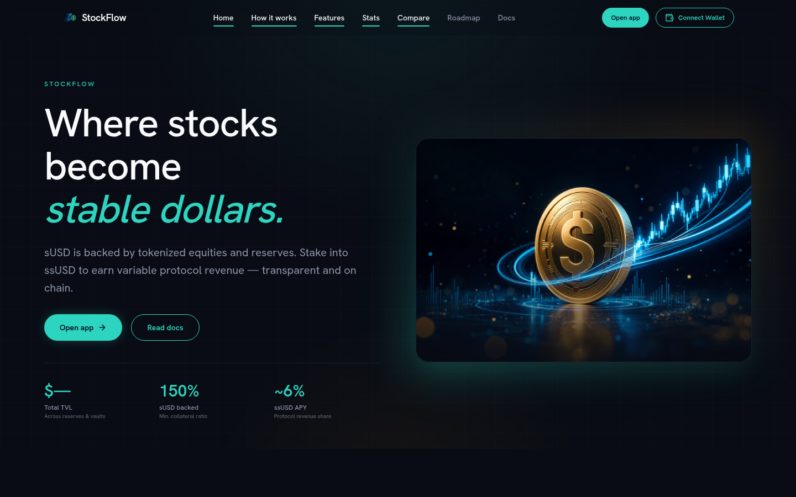
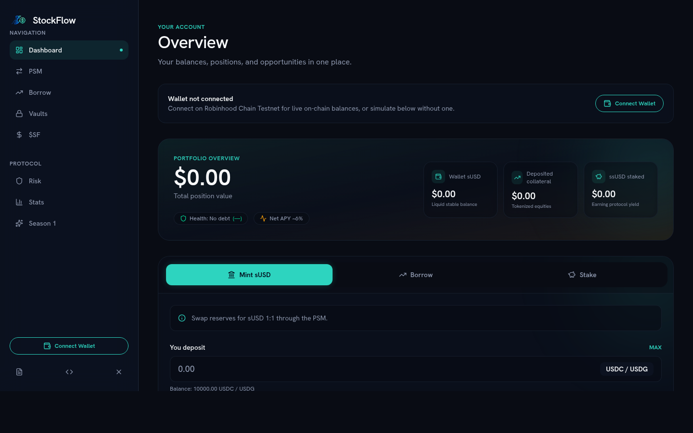
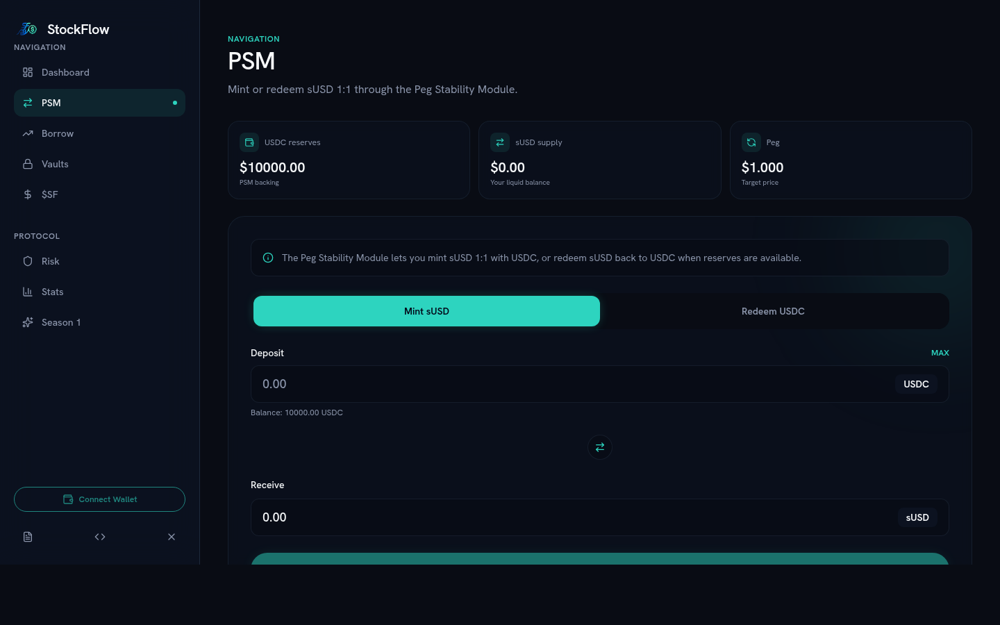
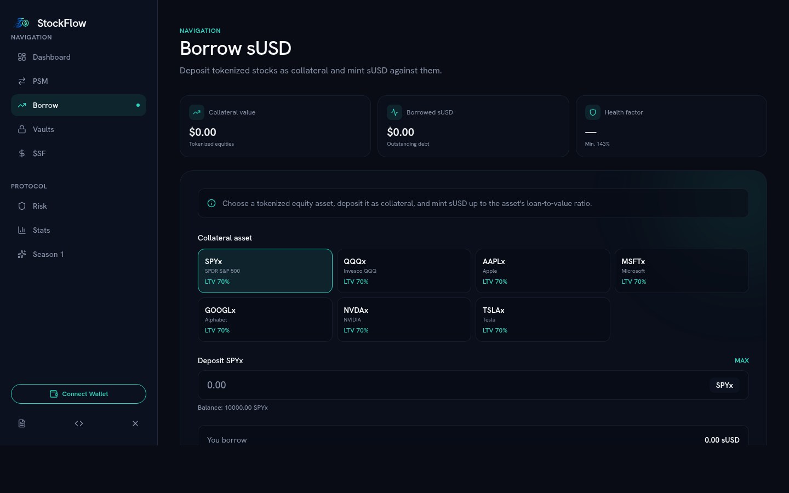
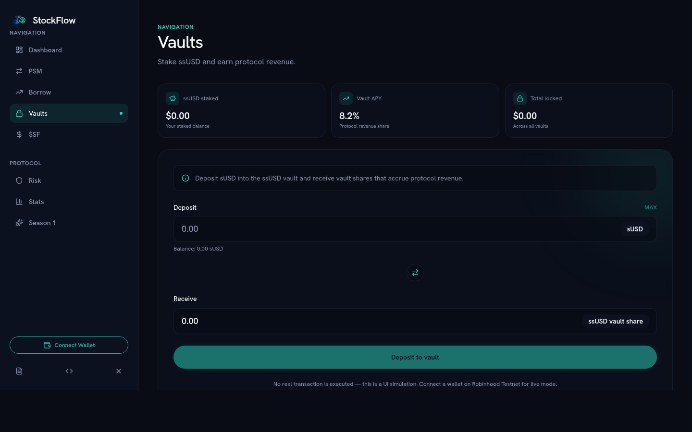

# StockFlow

<p align="center"></p>

**sUSD — a dollar stablecoin backed by tokenized stocks on Robinhood Chain.**

Live app: https://stockflowapp.fun · X: https://x.com/_StockFlow

StockFlow lets holders of tokenized equities (xStocks such as SPYx, QQQx, AAPLx, MSFTx, GOOGLx, NVDAx, TSLAx) unlock liquidity without selling. Deposit stocks as collateral, mint **sUSD**, stake it for **ssUSD** yield, and take part in governance with **$SF**.

The protocol is currently live on **Robinhood Chain Testnet** (chain ID `46630`) with real on-chain transactions.

---

## Screenshots

| Landing page | Dashboard |
| --- | --- |
|  |  |

| PSM (mint / redeem) | Borrow | Vaults |
| --- | --- | --- |
|  |  |  |

---

## Features

| Module | Description |
| --- | --- |
| **PSM** | Mint / redeem sUSD 1:1 against USDC or USDG reserves |
| **Borrow** | Deposit xStocks as collateral and mint sUSD up to the asset LTV, with live health factor |
| **Staking Vault** | Stake sUSD → receive ssUSD share tokens that accrue protocol revenue |
| **$SF Lock** | Lock $SF for voting power and revenue share |
| **Faucet** | Testnet-only: claim test USDC, USDG and xStocks |
| **Risk / Stats / Season** | Protocol parameters, market metrics and points program |
| **Docs / Roadmap** | Protocol documentation and delivery roadmap |

The dApp works in two modes:

- **Live mode** — wallet connected on Robinhood Chain Testnet: every action is a real transaction (approve + execute) with explorer links.
- **Simulation mode** — no wallet / wrong network: the UI simulates balances so the flow can be explored safely.

---

## Repository layout

```
.
├── app/                 # Next.js App Router pages (landing, /app dashboard, /docs, /roadmap)
│   └── app/             # Dashboard, borrow, psm, vaults, sf, risk, stats, season
├── components/          # UI components (dashboard, tx panel, wallet button, simulation context…)
├── lib/
│   ├── wagmi.ts         # Robinhood Chain mainnet + testnet chain config
│   ├── contracts.ts     # Deployed addresses + ABIs (generated from contracts/)
│   └── onchain.ts       # Live reads/writes hook (approvals, tx status, explorer links)
├── public/              # Logo, hero and banner assets
└── contracts/           # Hardhat 3 project (Solidity 0.8.27, OpenZeppelin)
    ├── contracts/       # sUSD, ssUSD, PSM, Borrow, StakingVault, SFLock, mocks
    ├── scripts/         # deploy.ts, e2e.ts
    └── deployed-addresses.json
```

---

## Tech stack

- **Frontend:** Next.js (App Router, static export), React, TypeScript, Tailwind CSS v4
- **Wallet / chain:** wagmi, viem, RainbowKit (WalletConnect), TanStack Query
- **Contracts:** Hardhat 3 (ESM), Solidity 0.8.27, OpenZeppelin Contracts v5

---

## Getting started (frontend)

Requirements: Node.js ≥ 22.

```bash
npm install
cp .env.example .env.local   # set NEXT_PUBLIC_WC_PROJECT_ID
npm run dev                  # http://localhost:3000
```

Other scripts:

```bash
npm run lint    # eslint
npm run build   # static export to ./dist
```

The build output is a plain static site (`dist/`) and can be hosted on any static host.

---

## Contracts

```bash
cd contracts
npm install
cp .env.example .env         # RH_TESTNET_RPC + DEPLOYER_KEY (never commit this file)
npm run compile
npm run deploy:testnet       # deploys everything and writes deployed-addresses.json
npm run e2e:testnet          # runs a full mint → borrow → stake → lock flow on testnet
npm run verify:testnet       # verifies source code on the Blockscout explorer
```

### Network

| | |
| --- | --- |
| Chain | Robinhood Chain Testnet |
| Chain ID | `46630` |
| RPC | `https://rpc.testnet.chain.robinhood.com` |
| Explorer | https://explorer.testnet.chain.robinhood.com |
| Gas faucet | https://faucet.testnet.chain.robinhood.com |

### Deployed testnet addresses

All contracts are source-verified on the explorer (click an address to read the code).

| Contract | Address |
| --- | --- |
| sUSD | [`0xc27296065B9e9679870AbeF08FBfD4F1D197d320`](https://explorer.testnet.chain.robinhood.com/address/0xc27296065B9e9679870AbeF08FBfD4F1D197d320#code) |
| ssUSD | [`0xC5660f6FEb7a7E394c004D473aC05DF8D5E73d61`](https://explorer.testnet.chain.robinhood.com/address/0xC5660f6FEb7a7E394c004D473aC05DF8D5E73d61#code) |
| SF | [`0x3b94D0a52575292c2DF8175Bf83C2a28B9eA9526`](https://explorer.testnet.chain.robinhood.com/address/0x3b94D0a52575292c2DF8175Bf83C2a28B9eA9526#code) |
| PSM | [`0x6A0d24E0F7d4F253c68E5021566062778Fc2DCb4`](https://explorer.testnet.chain.robinhood.com/address/0x6A0d24E0F7d4F253c68E5021566062778Fc2DCb4#code) |
| Borrow | [`0xB999dd76A37cd0032D5C47179709Cb998339A8F2`](https://explorer.testnet.chain.robinhood.com/address/0xB999dd76A37cd0032D5C47179709Cb998339A8F2#code) |
| StakingVault | [`0x6b24f651Cf64471c6baf7a145A2e8284cbC5501d`](https://explorer.testnet.chain.robinhood.com/address/0x6b24f651Cf64471c6baf7a145A2e8284cbC5501d#code) |
| SFLock | [`0x5C9a13aD498B9D75291245B73f3EB086E4694E75`](https://explorer.testnet.chain.robinhood.com/address/0x5C9a13aD498B9D75291245B73f3EB086E4694E75#code) |
| MockFaucet | [`0xFe5ED0C296bDD376E5fC305E466b0b07967a80E7`](https://explorer.testnet.chain.robinhood.com/address/0xFe5ED0C296bDD376E5fC305E466b0b07967a80E7#code) |
| Mock USDC | [`0x3d66CF6DF47481B00D055e660F340b3957C6c7Ff`](https://explorer.testnet.chain.robinhood.com/address/0x3d66CF6DF47481B00D055e660F340b3957C6c7Ff#code) |
| Mock USDG | [`0x3900AdaE205dC19156905A45CB6CF0B9Ea40D9bF`](https://explorer.testnet.chain.robinhood.com/address/0x3900AdaE205dC19156905A45CB6CF0B9Ea40D9bF#code) |

xStock mocks and price feeds are listed in [`contracts/deployed-addresses.json`](contracts/deployed-addresses.json).

### Protocol flow

```
USDC/USDG ──approve──▶ PSM.mint ────────────▶ sUSD
xStock    ──approve──▶ Borrow.depositCollateral ──▶ Borrow.mintStable ──▶ sUSD
sUSD      ──approve──▶ StakingVault.deposit ─▶ ssUSD
SF        ──approve──▶ SFLock.lock ──────────▶ voting power
```

- `sUSD` / `ssUSD` use OpenZeppelin `AccessControl`; `MINTER_ROLE` is granted to PSM, Borrow and StakingVault.
- Borrow assets are configured with 70 % LTV and mock Chainlink-style price feeds.

> **Disclaimer:** the testnet contracts are minimal, unaudited mocks intended for testing the product flow. They are not the mainnet contracts and must not be used with real funds.

---

## Roadmap

1. **Testnet** — core protocol, full dApp, wallet connectivity, real testnet transactions ✔
2. **Audit & hardening** — contract audits, production oracles, final risk parameters
3. **Mainnet** — sUSD launch on Robinhood Chain with official xStocks as collateral
4. **Governance** — $SF voting and protocol revenue distribution

---

## License

MIT
